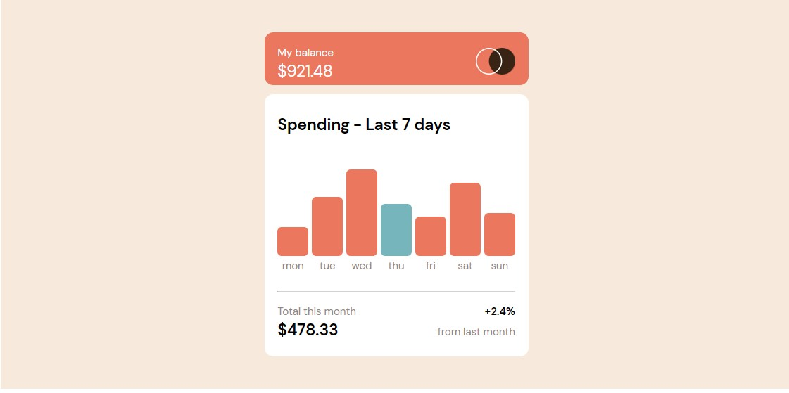

# Expense Chart

[Expense Chart](https://expense-chart-orcin.vercel.app) is a frontend react project developed with mobile devices in mind. It showcases the interface of an expenses chart which is but a fragment of a mor complex fintech app. Hover on in each of the chart bars to see the corresponding amount surface

## Table of contents

- [Overview](#overview)
  - [Screenshot](#screenshot)
  - [Links](#links)
- [My process](#my-process)
  - [Built with](#built-with)
  - [What I learned](#what-i-learned)
  - [Continued development](#continued-development)
- [Author](#author)
- [Acknowledgments](#acknowledgments)

## Overview

### Screenshot



### Links

- Source code: [https://github.com/itksweb/expense-chart](https://github.com/itksweb/expense-chart)
- Live Site URL: [https://expense-chart-orcin.vercel.app](https://expense-chart-orcin.vercel.app)

## My process

### Built with

- [React](https://reactjs.org/) - JS library

### What I learned

```js
const whenMouseOver = (e) => {
  e.target.previousElementSibling.style.visibility = "visible";
};
const whenMouseOut = (e) => {
  e.target.previousElementSibling.style.visibility = "hidden";
};
```

```js
//gets the height of each chart bar
const barInnerHeight =
  maxAmount > 0 ? Math.round((amount / maxAmount) * 100) + "px" : "0%";

//sets the chart bar style inline
const myDayStyle = { height: barInnerHeight };
```

## Author

- WhatsApp - [here](https://wa.me/2348060719978)
- LinkedIn - [here](https://www.linkedin.com/in/kingsleyikpefan)
